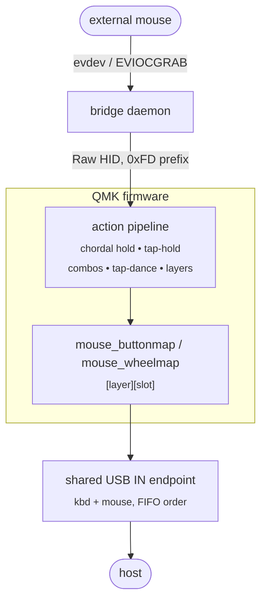
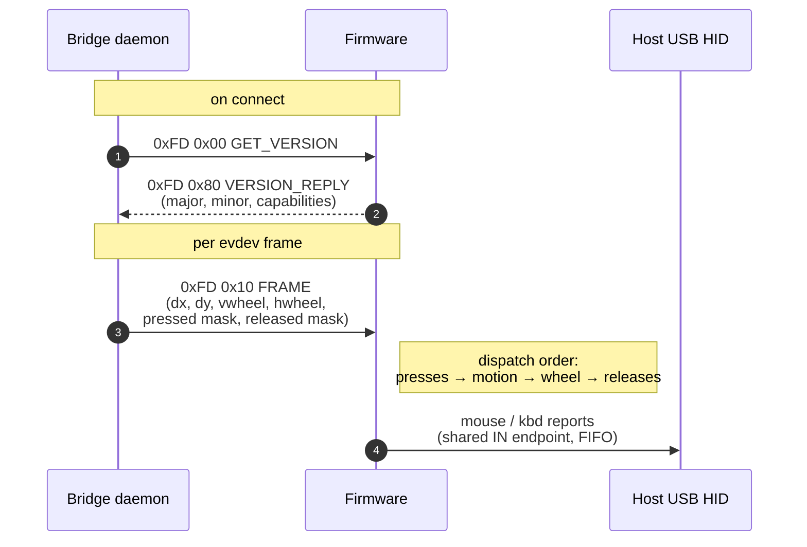

# Mouse-as-input for QMK

Make host-side mouse events first-class QMK inputs. Buttons, wheel and motion
flow through the same action pipeline as your keyboard keys — so home-row
mods compose with clicks, mouse buttons can carry layers, the wheel can be
remapped per-layer, and combos / tap-dance / custom keycodes all just work on
mouse events.

Two opt-in features. **`MOUSE_MAP_ENABLE`** wires mouse buttons and wheel
into the keymap. **`RAW_HID_MOUSE_ENABLE`** lets a small host-side daemon
route an external USB mouse through the keyboard, so the same composition
works for the mouse you already own — not just a keyboard with an embedded
trackball.

## What this enables

* **Shift-click on a held home-row mod, deterministically.** Hold the `S` in
  `LSFT_T(KC_S)`, click — the click is shifted. No tapping-term wait, no
  cross-device race in libinput. The mouse event arrives at the action
  pipeline as a synthetic non-`KEY_EVENT`, which `CHORDAL_HOLD` (or
  `HOLD_ON_OTHER_KEY_PRESS` / `PERMISSIVE_HOLD`) treats as cross-hand and
  resolves the tap-hold to **hold** before the click reaches the host.

* **Per-layer mouse buttons and wheel.** Identical model to `encoder_map` —
  one cell per (layer × button). Holds, mod-taps, layer-taps, custom keycodes,
  combos and tap-dance all compose.

* **Layer keys *on* mouse buttons.** Put `LT(_NAV, KC_NO)` on a side button
  and the mouse itself becomes a layer source. Tap it for the side-button
  action, hold it for `_NAV`.

* **Auto-mouse-layer for external mice.** Composes with
  `POINTING_DEVICE_AUTO_MOUSE_ENABLE`: motion and button-down from the
  routed mouse activate the auto-mouse layer the same way an internal
  pointing sensor does.

* **Flag-only opt-in.** No keymap code required. Set `MOUSE_MAP_ENABLE = yes`
  and an identity passthrough (`MS_BTN<n>`, `MS_WHL{U,D,L,R}`) is supplied
  by the firmware — every button still flows through the action pipeline,
  so HRM settling works without you touching a `.c` file.

* **Plays nicely with VIA.** Raw HID is dispatched through a new handler
  chain in `quantum/raw_hid.c`; VIA and the mouse bridge share the same
  endpoint without stepping on each other.

* **Any QMK keyboard.** The daemon discovers keyboards by the standard
  QMK Raw HID usage tag (`0xFF60` / `0x61`). No per-keyboard customisation.

## Architecture



Without `RAW_HID_MOUSE_ENABLE`, the daemon and external mouse drop out; an
internal pointing sensor feeds the same pipeline directly.

## What the keymap looks like

Identical model to `encoder_map`: per-layer 2D array, one cell per
(layer × slot). Each cell is a regular QMK keycode — anything you can
put in `keymaps[]` works here.

```c
const uint16_t PROGMEM mouse_buttonmap[][MOUSE_BUTTON_COUNT] = {
    //           LMB      RMB      MMB      side-back          side-fwd           6        7        8
    [BASE]   = { MS_BTN1, MS_BTN2, MS_BTN3, LCTL_T(KC_WBAK),   LSFT_T(KC_WFWD),   MS_BTN6, MS_BTN7, MS_BTN8 },
    [LAYER1] = { C(KC_V), C(KC_X), C(KC_C), KC_ENT,            KC_TRNS,           KC_TRNS, KC_TRNS, KC_TRNS },
    [LAYER2] = { C(KC_V), C(KC_X), C(KC_C), KC_ENT,            KC_TRNS,           KC_TRNS, KC_TRNS, KC_TRNS },
    [LAYER3] = { C(KC_V), C(KC_X), C(KC_C), KC_ENT,            KC_TRNS,           KC_TRNS, KC_TRNS, KC_TRNS },
};

const uint16_t PROGMEM mouse_wheelmap[][NUM_MOUSE_WHEEL_DIRECTIONS] = {
    //           up       down     left     right
    [BASE]   = DEFAULT_MOUSE_WHEELMAP,
    [LAYER1] = { KC_LEFT, KC_RIGHT, KC_NO,  KC_NO },
    [LAYER2] = { KC_BSPC, KC_DEL,   KC_NO,  KC_NO },
    [LAYER3] = { KC_PGUP, KC_PGDN,  KC_NO,  KC_NO },
};
```

Three patterns worth stealing:

**Mod-tap side buttons on `BASE`.** `LCTL_T(KC_WBAK)` /
`LSFT_T(KC_WFWD)` — tap is browser back / forward, hold is Ctrl / Shift.
This is the slot that pays back the most: Ctrl-click and Shift-click
are the two modifier+click combos you use constantly (multi-select,
range-select, open-in-new-tab, go-to-definition, …), and the right
thumb is the only way to perform them without lifting the right hand
off the mouse. HRMs don't help here — once the right hand is on the
mouse, the right-hand HRMs are unreachable and the left-hand HRMs
require keeping the left hand pinned to the home row.

**Stable button bindings across active layers.** `LAYER1`, `LAYER2`,
`LAYER3` all turn LMB / RMB / MMB into paste / cut / copy and the
side-back into Enter. Same buttons no matter which layer you flipped
into with the left hand — muscle memory stays intact. Side-fwd is left
as `KC_TRNS` so Shift-click still works on these layers; that detail
is worth keeping.

**Wheel rebinds per layer, independently of buttons.** With the buttons
held fixed, the wheel is free to track context: arrow keys on `LAYER1`
for cursor nudging, backspace / delete on `LAYER2`, page up / down on
`LAYER3`. Same right-hand surface, different secondary action depending
on what your left hand is doing.

The eight button slots are the standard USB-HID / Linux-evdev codes:
`BTN_LEFT`, `BTN_RIGHT`, `BTN_MIDDLE`, `BTN_SIDE`, `BTN_EXTRA`,
`BTN_FORWARD`, `BTN_BACK`, `BTN_TASK`. On a typical 5-button mouse
only slots 1–5 are physically populated; slots 6–8 are dead unless
your mouse emits the corresponding evdev code.

For layers the mouse shouldn't react to (e.g. a symbol layer you hold
with the right hand — by definition you're not on the mouse while it's
active), assign `DEFAULT_MOUSE_BUTTONMAP` / `DEFAULT_MOUSE_WHEELMAP` to
get identity passthrough on that row in one keyword.

Don't want to map anything at all? Skip the arrays entirely — the
firmware-supplied identity passthrough still routes events through
the action pipeline (so HRM settling works) and emits each button
as its corresponding `MS_BTN<n>`.

## Wire protocol (`RAW_HID_MOUSE_ENABLE`)

All packets are 32 bytes, little-endian, prefixed with `0xFD`:

```
  [0xFD] [subkind] [payload (30 bytes)]
```



| Subkind | Direction | Name            | Payload                                                  |
|--------:|:---------:|-----------------|----------------------------------------------------------|
| `0x00`  | host→kbd  | `GET_VERSION`   | (empty)                                                  |
| `0x01`  | host→kbd  | `PING`          | u8\[30\] echo                                            |
| `0x10`  | host→kbd  | `FRAME`         | i16 dx, i16 dy, i8 vwheel, i8 hwheel, u8 pressed, u8 released |
| `0x80`  | kbd→host  | `VERSION_REPLY` | u8 major, u8 minor, u8\[28\] capabilities                |
| `0x81`  | kbd→host  | `PONG`          | u8\[30\] echo                                            |

One `FRAME` per evdev frame keeps USB transactions low and gives the
firmware atomic visibility into a frame. The in-frame dispatch order is
what makes chordal-hold and `HOLD_ON_OTHER_KEY_PRESS` settle pending
tap-holds before the click report is queued.

Forward-compatibility: unknown subkinds are silent no-ops, subkinds are
append-only, `major` is pinned at 1. The capability bitmap in
`VERSION_REPLY` lets newer daemons degrade gracefully against older
firmware.

## Why this is the right place to do it

The "modifier-before-click" property has been the goal of several
host-side hacks (uinput injection, atomic frame replay, fixed delays).
All of them fight libinput's cross-device dispatch ordering. Routing
the click through the keyboard, into the same FIFO as the modifier
report, sidesteps the race entirely: the host sees both events on a
single device in firmware-queue order.

That same routing is what makes layers, combos and tap-dance compose —
the action pipeline already knows how to do all of this for keyboard
keys; it just needed mouse events delivered in the same currency.

## Getting started

Firmware:

```make
MOUSE_MAP_ENABLE   = yes
RAW_HID_MOUSE_ENABLE = yes   # optional, for external-mouse routing
```

Plus, if you enable `RAW_HID_MOUSE_ENABLE`, in `config.h`:

```c
#define KEYBOARD_SHARED_EP
#define MOUSE_SHARED_EP
```

These keep keyboard and mouse reports in a single endpoint FIFO — that's the
ordering guarantee the settling property rides on.

Host daemon (this directory):

| File                                                    | Role                                  |
|---------------------------------------------------------|---------------------------------------|
| [`qmk_mouse_bridge.py`](qmk_mouse_bridge.py)            | The daemon — single Python script.    |
| [`install.sh`](install.sh)                              | Installs the udev rule + systemd unit.|
| [`99-qmk-mouse-bridge.rules`](99-qmk-mouse-bridge.rules)| udev rule (matches by usage tag).     |
| [`qmk-mouse-bridge.service`](qmk-mouse-bridge.service)  | systemd `--user` unit.                |
| [`requirements.txt`](requirements.txt)                  | Python deps.                          |

Discovery is by the standard QMK Raw HID usage tag (`0xFF60` / `0x61`), so
the daemon works against any QMK keyboard with `RAW_HID_MOUSE_ENABLE` — no
per-keyboard config.

Tap-hold needs to be set up to actually settle, of course. **Any of**
`CHORDAL_HOLD`, `HOLD_ON_OTHER_KEY_PRESS`, or `PERMISSIVE_HOLD` is sufficient
(or any per-key flavour); the default tap-hold mode is not — it waits the
full `TAPPING_TERM` before a click can settle a held mod.
